<p align="center">
  
</p>

# Bemby v1.0.0

[](https://hub.docker.com/r/liveinaus/bemby)
[](https://github.com/liveinaus/BembyPro/blob/main/CHANGELOG.md)
[](https://t.me/cool_bemby)

[English](#english) | **简体中文**

> 如果 Bemby 为你节省了时间，欢迎在 GitHub 上给它点个 Star，帮助更多人发现这个项目。

一款自托管的自动化工具，用于管理每日 Telegram 机器人签到和 Emby 视频观看会话。内置 Web 管理门户，支持多账号和多任务管理。

Bemby可签到市面上所有的服（需要正确配置）。无论是TG内，网页，小程序，回答问题或者验证码。同时 Bemby 有完整的 Web TG 应用，支持批量入群，订阅，抽奖，更多玩法等你来挖掘。同时感谢群友们的建议，意见与测试。

最后请大家支持公益服，切勿滥用，祝大家玩的开心。

<table width="100%">
  <tr>
    <td align="center" colspan="3">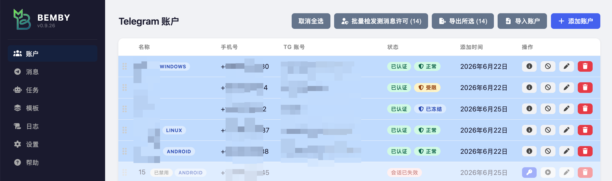<br/><sub>账户配置</sub></td>
  </tr>
  <tr>
    <td align="center" colspan="3">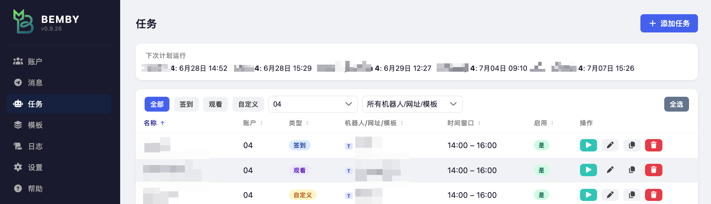<br/><sub>任务配置</sub></td>
  </tr>
  <tr>
    <td align="center" width="33.33%">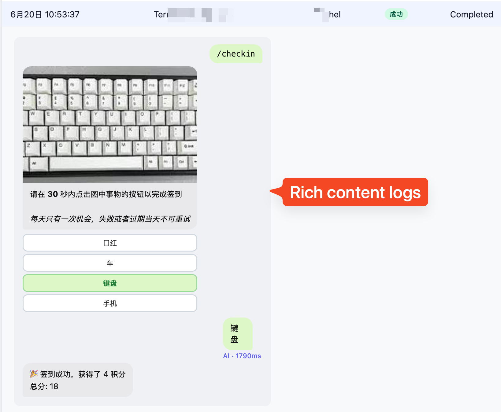<br/><sub>丰富内容日志</sub></td>
    <td align="center" width="33.33%">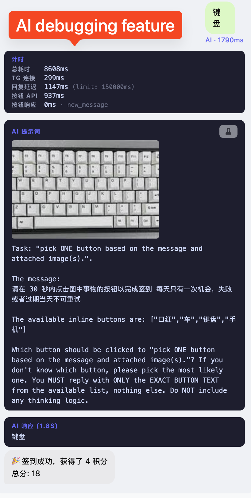<br/><sub>AI 调试</sub></td>
    <td align="center" width="33.33%">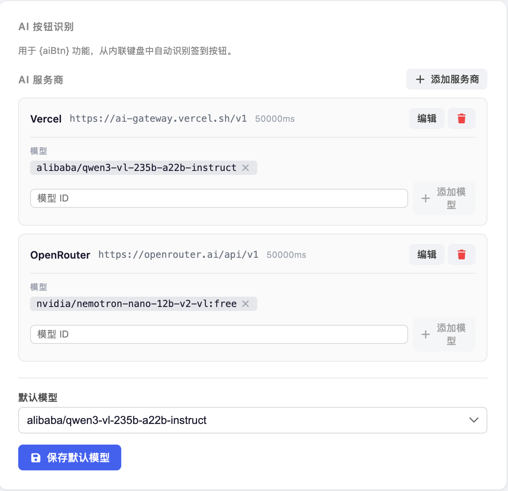<br/><sub>AI 设置</sub></td>
  </tr>
  <tr>
    <td align="center" width="33.33%">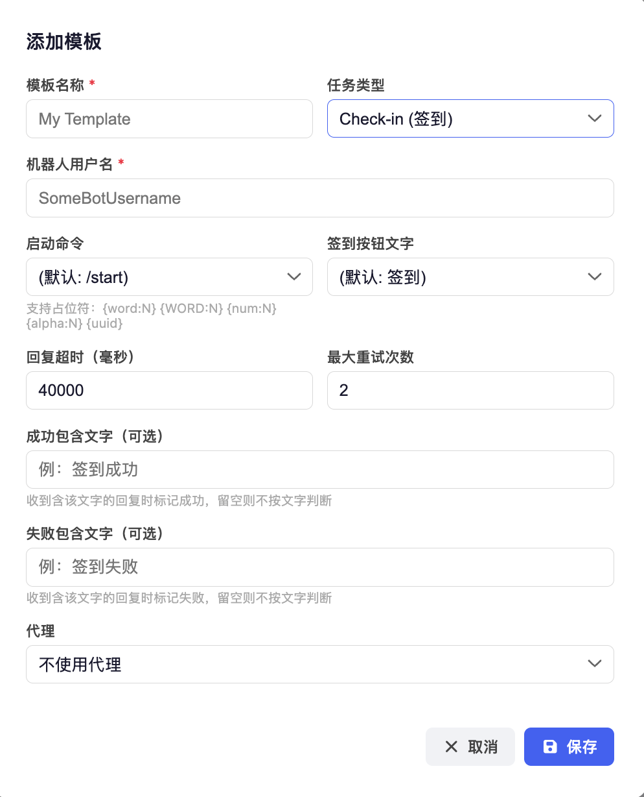<br/><sub>添加签到模版</sub></td>
    <td align="center" width="33.33%">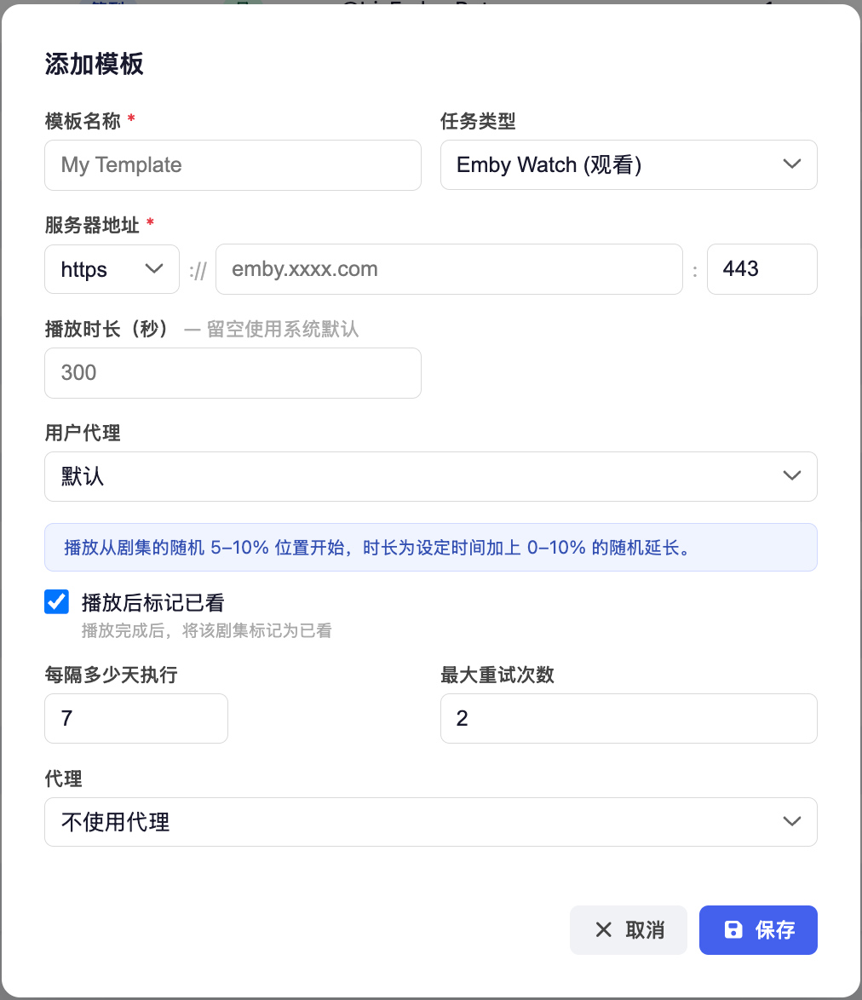<br/><sub>添加观看模版</sub></td>
    <td align="center" width="33.33%">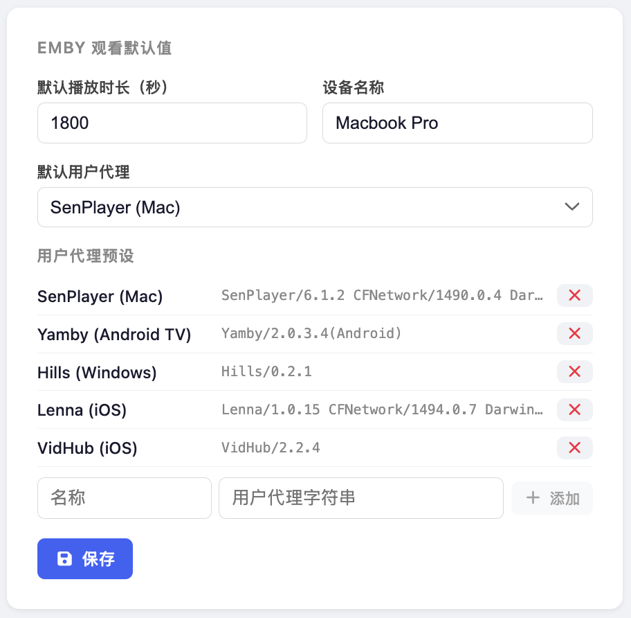<br/><sub>观看 UA 配置</sub></td>
  </tr>
  <tr>
    <td align="center" width="33.33%">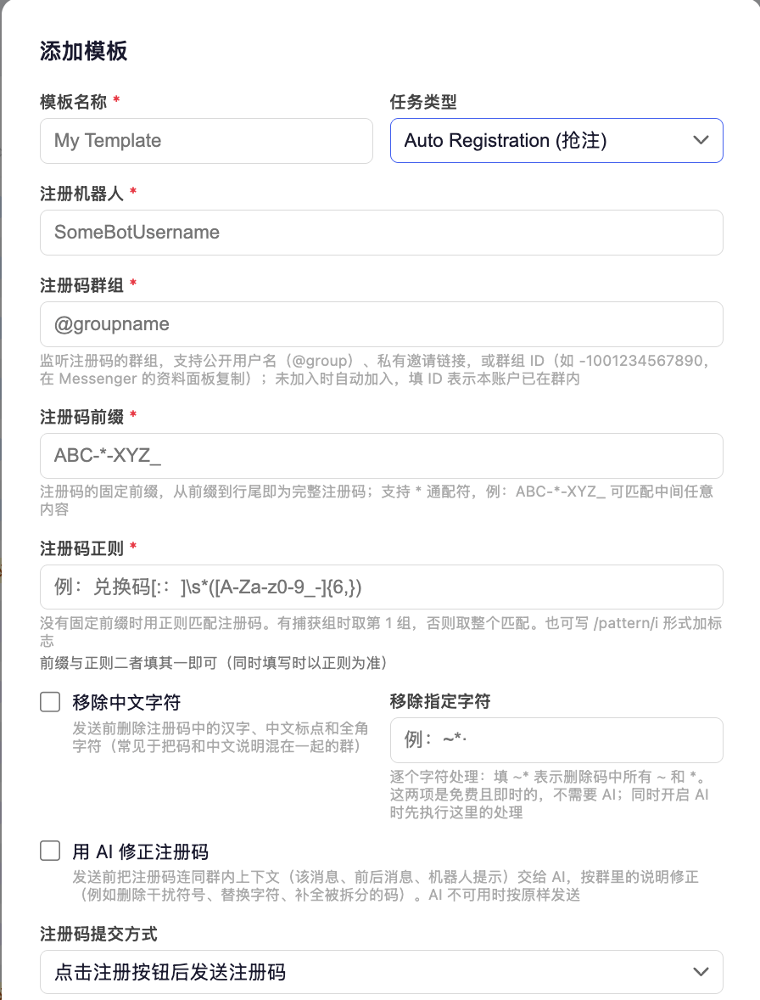<br/><sub>添加抢注任务</sub></td>
    <td align="center" width="33.33%">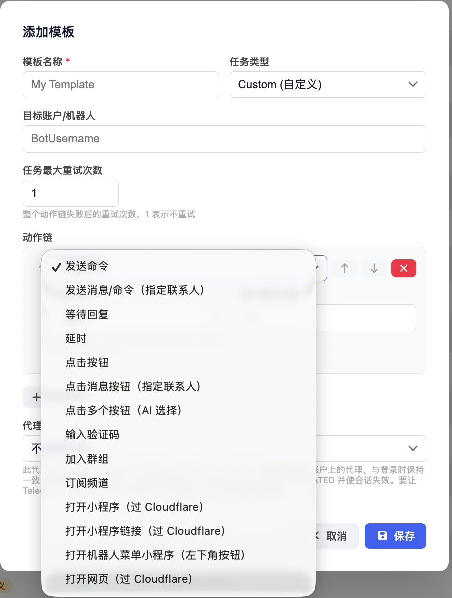<br/><sub>添加自定义任务</sub></td>
    <td align="center" width="33.33%">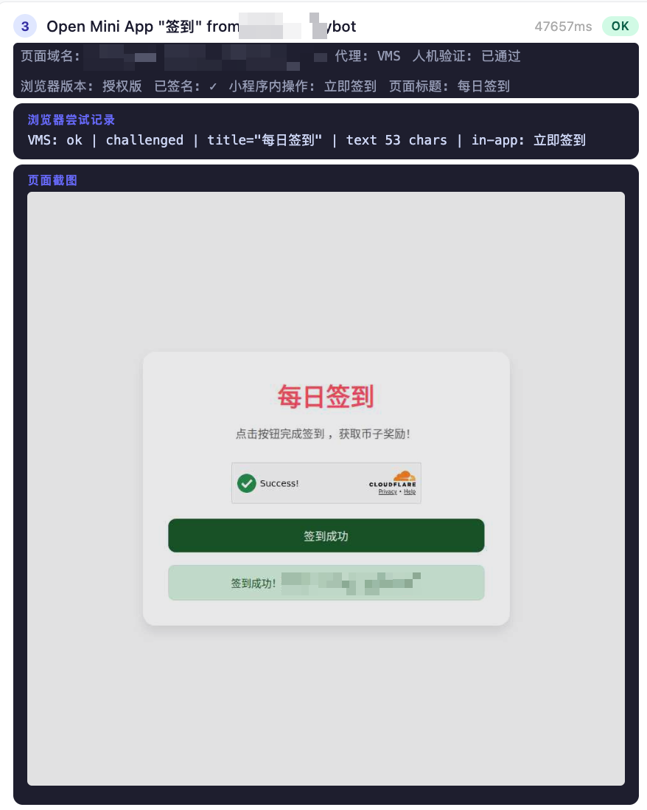<br/><sub>过 CF 人机验证</sub></td>
  </tr>
  <tr>
    <td align="center" width="33.33%">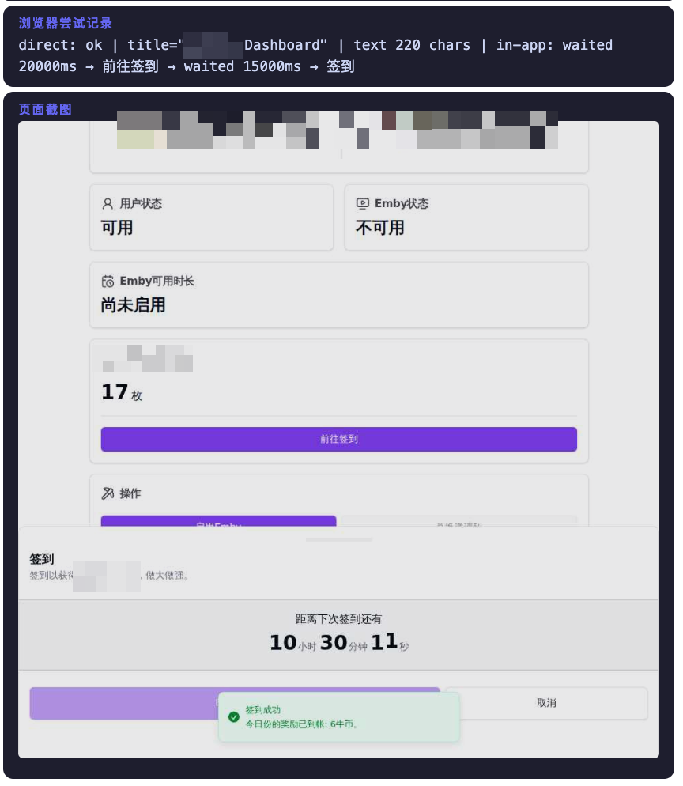<br/><sub>网页版签到</sub></td>
    <td align="center" width="33.33%">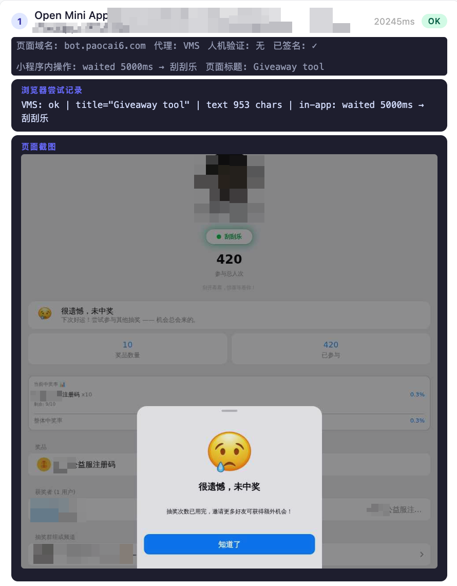<br/><sub>抽奖</sub></td>
    <td align="center" width="33.33%">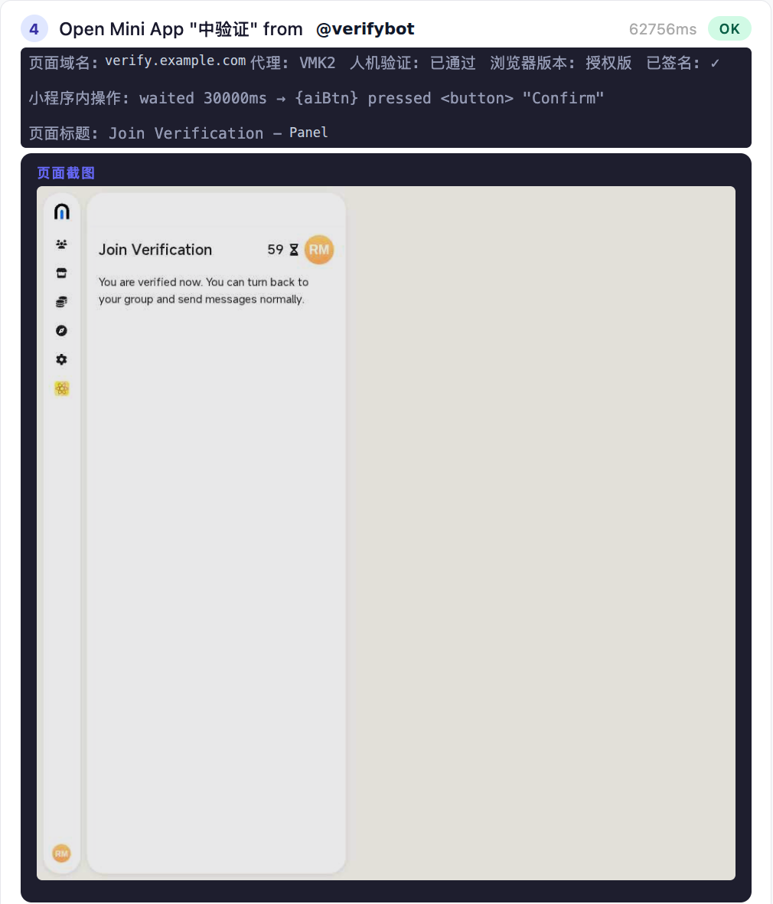<br/><sub>过入群人机验证</sub></td>
  </tr>
</table>


---

## Pro 版比开源版 1.0.0 多了什么

开源版停在 v1.0.0（镜像 `:latest`，2026 年 8 月）。之后的开发都只在 Pro（镜像 `:pro`）中，主要新增如下；逐条说明见[更新日志](CHANGELOG.md)。

**网页与小程序自动化**
- **大量新的网页子步骤** -- 键盘输入、按键（Enter / Ctrl+Enter）、长按与按偏移长按、拖动滑块或拼图、下拉选择、跳转与后退、滚动到元素、读取文字、选取与收集元素、在页面运行脚本
- **流程控制** -- 条件分支（if / else）、按次数循环、按列表逐个循环（for each）、提前以成功或失败结束任务、把任务移交给另一个模板
- **变量与 AI 填写** -- 设置变量（含随机占位符）、AI 按提示写入输入框、运行中途发送通知
- **邮箱与两步验证** -- 从邮件读取验证码或验证链接、从地址池领取邮箱、msOauth2api 邮箱登录、抓取两步验证密钥并计算动态码（TOTP）
- **通行密钥（Passkey）** -- 用虚拟安全密钥注册并保存通行密钥，之后用它登录，无需硬件
- **图片验证码** -- AI 识别 hCaptcha 一类的选图验证码；AI 可一次点击多个位置；小程序内也能过 Cloudflare Turnstile；支持 iframe 内的页面
- **实时查看与手动操作浏览器** -- 通过 VNC 实时观看任务中的浏览器，也可以手动打开浏览器操作；浏览器配置文件（Profile）可管理、改名、清理，也可不使用配置文件
- **回复键盘里的小程序** -- 输入框上方的小程序按钮也能打开，其 `sendData` 结果会像官方客户端一样转交给机器人

**数据**
- **数据仓库** -- 以文件夹和记录的形式长期保存数据（注册出的账号、邀请码等），任务中用 `{data.文件夹.键}` 读取，也可在任务中写入和删除；支持排序、筛选、导入、导出（含明文格式）
- **按数据文件夹逐条循环** -- 每条记录执行一轮，可跳过已处理的记录，重跑时从上次停下处继续

**Telegram 账户**
- **导入卡密（session）账户** -- 批量导入购买的 session 账户，导入前可检查是否存活，之后可批量接管所有权
- **批量设置隐私**、**批量提取消息**（按关键词和正则从某个聊天中提取内容，可写入数据仓库）
- **资料批量设置** -- 随机头像（可预先上传头像图库，支持 zip）、用户名（@handle）
- **分享手机号**、账户搜索与筛选、手机号校验、Telegram 头像与用户 ID 列、「轻度限制」识别、手动重新连接

**消息页（Messenger）**
- 频道私信、投票与测验（可投票并查看结果）、@提及没有用户名的群成员、群成员搜索、群服务消息、被回复消息的预览与跳转、贴纸显示、按账户记住所选文件夹
- 升级到 Telegram 第 229 层，可以显示机器人发来的富文本页面消息

**任务与调度**
- **一次性任务**、所有任务类型都支持「每 X 天运行一次」、任务图标、任务列表筛选
- **签到更灵活** -- 按文字匹配按钮、多个关键词、优先点击置顶消息中的按钮、从最后一条消息的关键词点击签到按钮
- **入群验证** -- 用 AI 选择入群验证按钮（可自定义提示），以测验投票形式出的入群题也能作答
- **批量任务** -- 在后台运行，可暂停、跳过、调整间隔；从模板批量创建任务时可按多种条件筛选账户
- **单个任务可覆盖代理**；在任务列表中直接编辑模板
- **调度更稳** -- 升级后保持原定时间、卡死的运行会被回收、当天错过的运行当天补上、同时运行上限可调

**代理**
- **节点订阅**（VLESS / VMess / Trojan / Shadowsocks，内置 Xray 核心）、**全局代理**（适合中国大陆使用）、随机代理池、代理健康检查与测试、自动刷新

**Emby 观看**
- 支持更多服务器（包括需要播放会话的网关）、可忽略无效 SSL 证书、可为观看任务单独设置代理

**系统**
- 浅色 / 深色主题、版本更新检查、设置中查看系统日志、重启系统、Telegram 连接列表与连接数上限、忘记密码时的重置方式
- 运行截图不再写入数据库（实测 527MB → 35MB），面板首屏体积减少约 70%

---

## 功能特性

- **多账号** — 管理多个 Telegram 账号，每个账号通过 MTProto 独立认证；支持拖拽排序；会话失效时自动标记并显示重新认证按钮；代理徽章直接显示在账号行；账号列表新增 TG 账号列，显示 Telegram 显示名称和用户名（存储于数据库，首次访问自动获取，可手动刷新）；手机号下方自动显示根据号码解析出的国旗与国家名称；可切换显示"额外信息"列（登录邮箱、受限状态、通行密钥标记）；表格中可按住 Shift 点击选中连续区间；名称、手机号、状态、添加时间列支持点击排序（升序 → 降序 → 恢复手动顺序，排序状态跨刷新保留，排序或搜索时停用拖拽）；添加/编辑账号表单校验名称、手机号及（无全局默认凭据时的）API ID/Hash
- **Telegram 账户安全管理** — 在账户编辑面板的"高级"选项卡中管理 2FA 密码（设置/修改/移除）、活跃会话（查看设备信息、单独终止或一键终止所有其他设备）、恢复邮箱（查看、设置、更改或移除；含完整的邮件确认流程）、以及通行密钥（查看、添加、移除已注册的 Passkeys；添加后可"使用通行密钥登录"，仅需再输入 2FA 密码，另可"验证"通行密钥是否仍被 Telegram 接受，实验性功能）
- **更新 Telegram 个人资料** — 在"个人资料"选项卡中直接修改该账户的名字、姓氏和简介
- **账户备注** — 可为每个账户添加自由文本备注；表格中备注列可切换显示；支持批量设置备注
- **批量账户管理** — 账户批量操作统一收纳至"批量操作"菜单，各顺序操作共用"每个账户之间的间隔（秒）"以避免 Telegram 限流：**批量重命名**（`{index}` 递增序号、可补零、实时预览）、**批量获取属性**（刷新 TG 信息与附加属性）、**批量修改登录邮箱**（`+` 标签模板 + 变量，经 Gmail IMAP 读取确认码，应用专用密码仅用于本次运行、绝不存储）、**批量修改凭据**（设置/轮换 2FA 密码，可选移除其他设备/其他通行密钥、按模板追加备注）、**批量提取消息**（在所选账户上分别读取同一个会话——@用户名、t.me 链接、邀请链接或会话 ID，逐账户各自解析——的历史消息，可只取某个日期之后的，先用关键词交给 Telegram 自身搜索缩小范围，再用正则提取（有捕获组时取第 1 组，也支持 `/pattern/flags`），按自定义格式（`{value}`、`{text}`、`{account}`、`{chat}`、`{id}`、`{date}`、`{sender}` 及 `{1}`、`{2}` 等捕获组）输出，可复制或下载为 .txt；开启数据管理后还可按指定的记录键/值格式直接写入数据存储）、**批量添加通行密钥**、**批量收紧隐私设置**（把所选账户的隐私项一次性收到最紧：电话号码、最后上线、头像、简介、生日、转发署名、来电、礼物展示等一律设为“无人”，Telegram 不允许无人的两项——“谁能通过号码找到我”与“谁能把我加入群组”——设为“我的联系人”；Premium 专属项不在此列）、**批量修改资料**（批量设置名字/姓氏/简介，每行一个账户、字段用 Tab 分隔，可从表格粘贴、一键生成随机名字，或按要求交给 AI 生成——一次请求覆盖全部账户、可只生成名字，结果自动清理为可用格式；后台批量执行、失败自动重试）；开启环境变量 `BULK_ACCOUNT_MANAGEMENT=1` 后还提供 **批量添加账户**（每行 `手机号----API网址`，自动创建并逐个从各 API 网页读取验证码/2FA 完成认证，支持名称编号方案、候选设备/代理/API 凭据随机选取、自定义提取正则）与 **批量清理**
- **账户备份加密** — 导出会话文件时可设置自定义密码保护；导入时自动识别加密状态并提示输入密码；"强制重新认证"选项可在导入时清除令牌，避免 Telegram 因同一令牌多设备使用而撤销会话
- **内置 Telegram 消息客户端** — 独立页面视图，直接在 Bemby 中与联系人、群组和频道聊天；支持表情回应、引用回复、内联图片查看、发送图片与文件、频道帖子评论线程、机器人命令自动补全、自动标记已读、贴纸显示、右键菜单静音（8小时/1周/永久）和取消静音、加入文件夹、编辑联系人姓名、简介链接化、小程序显示模式切换（应用内/浏览器）；拉黑/取消拉黑、举报（附原因与备注，举报用户/机器人时同步拉黑并删除聊天）、删除聊天/消息（可选"为对方也删除"）、编辑自己发送的消息、转发消息、多选批量转发/删除、双向输入中提示；群组/频道搜索兼顾本地标题匹配与全局搜索，结果更全面；移动端聊天头部按钮合并为 ⋯ 菜单，新增"跳转到最新消息"悬浮按钮；账号级"清除缓存"与"清理账号"（退出全部群组/删除全部私聊/移除全部联系人及文件夹，需二次确认）；打开非 Telegram 链接时可选择在 Bemby 内嵌或浏览器打开，内嵌前自动探测目标站点是否允许被嵌入，不允许时经内置代理加载并提示
- **四种任务类型**
  - **签到** — 在随机的每日时间向 Telegram 机器人发送可配置命令并点击回复按钮
  - **Emby 观看** — 在 Emby 服务器上模拟播放会话，从随机进度位置开始，定期上报播放进度，结束后可标记为已看；上报前可校验媒体文件是否可播放（磁盘在线），避免文件离线时上报虚假观看；可开启**真实观看**以真实播放速率直连拉取实际媒体字节（产生真实串流流量，注意消耗下行流量）；可开启**顺序播放**从上次离开处续播（无则播下一集，仍无则随机），看完一集自动接着下一集，仅在看完整集时才标记已看；可**限定媒体库**（填写库名或从 1 开始的序号，匹配不到或库内无可播内容时回退到整个服务器）；User Agent 可从内置预设（SenPlayer、Yamby、Hills、Lenna、VidHub）中选择，也可在设置中自定义；可关联可选的 Telegram 账号用于发送通知
  - **自定义** — 通过可配置的多步骤流程操作任意 Telegram 机器人，每步可触发命令、等待消息、点击按钮（支持 `{aiBtn}` AI 自动识别）、加入群组 / 订阅频道（支持公开用户名或私有邀请链接，可校验订阅状态、入群后点击验证按钮）、向指定联系人发送消息或点击其消息上的按钮、输入验证码（`enter_captcha` 步骤：复用上一步按钮点击后机器人的回复图片，无需二次等待，自动识别后发送答案）；发送命令步骤支持 `{aiInput}` / `{aiInput:N}` 占位符，自动将上一条消息中的图片发给 AI 识别并将识别结果填入命令；每个动作（延时除外）可独立配置最大重试次数，失败时仅重试该动作而不中断整个任务链；整个任务链也支持独立的最大重试次数；等待回复步骤支持可选的成功/失败文字匹配，收到含指定文字的回复时自动标记成功或失败；输入验证码步骤若 AI 返回字符数与预期长度不符则视为失败并触发重试；任务失败时完整保存已执行步骤的详细日志，AI 调用的提示词与响应始终写入步骤日志（无需开启开发者模式）
  - **自动注册** — 监听群组里发布的注册码并抢注：注册码可用固定前缀（支持 `*` 通配）或正则匹配（有捕获组时取第 1 组）；发送前可即时清理（移除中文字符 / 移除指定字符），也可交给 AI 按群内上下文修正（删除干扰符号、替换字符、补全被拆分的码）；提交方式支持"点击注册按钮后发送"与"随启动命令一并发送"；可分别配置发送注册码前与发送用户名前要等待的机器人提示文字，避免机器人未就绪时白白浪费一个码；对于"先校验注册码、通过后才给出开始注册按钮"的机器人，可开启注册码通过后再点击一次按钮/链接（支持回调按钮与 ?start= 链接，可自定义匹配文字），并可选择该步骤是必需（找不到按钮即换下一个码）还是可选（仅记录并继续）；被标记为已使用的码自动作废，用户名支持随机占位符
- **命令模板** — 支持在启动命令中嵌入随机占位符（`{word:N}`、`{num:N}`、`{num:1-30}` 指定范围的随机整数、`{num:01-30}` 同范围但固定位数、`{alpha:N}`、`{uuid}`、`{randomFirstName}`、`{randomLastName}`）；同一套占位符在自定义任务的发送内容、抢注用户名、网址，以及网页子步骤的「输入文本」与「跳转到网址」中同样可用，每次执行重新生成
- **AI 按钮识别** — 签到按钮文字设为 `{aiBtn}` 时，自动通过视觉大模型识别应点击的按钮（支持图片验证码类场景）；AI 返回结果与可用按钮不符时自动重试（最多不超过任务重试次数，硬性上限 5 次）；可在设置页面配置 API 地址、密钥和模型；支持配置多个服务商，默认模型报错时自动切换；默认模型精确锁定到具体的"服务商 + 模型"记录，避免不同服务商提供同名模型时用错凭据
- **小程序（Mini App）** — 在 Messenger 中直接打开机器人的小程序：聊天头部按钮、左侧机器人菜单，以及贴在输入框旁的机器人菜单小程序，均由 Telegram 按当前账户签名后打开；可选择在 Bemby 内嵌或浏览器打开。内嵌前先探测目标是否允许被嵌入，不允许时经内置代理提供同一页面（剥掉阻止内嵌的响应头、注入小程序桥接、补齐主题/版本/平台等启动参数），并使用仅对该站点有效的一次性票据而非面板令牌；设置 `WEBVIEW_PUBLIC_ORIGIN` 可让小程序拥有自己的源以正确路由自身路径
- **网页与小程序自动化** — 自定义任务可打开小程序（按钮、`t.me/<机器人>/<应用>` 链接、普通网址或机器人菜单）并在其中编排子步骤：点击、填写、按键（Enter / Ctrl+Enter，适用于没有发送按钮的输入框）、长按、拖动（滑块/拼图：指针沿轨迹分多次小步移动并带轻微弧度，而非瞬间跳到终点）、选择下拉框、设置变量、发送通知、等待元素、滚动、断言文字、勾选 Cloudflare Turnstile 复选框（小程序内的操作步骤写 `{turnstile}`；IP 良好时验证自动通过、页面上没有复选框时同样算成功）；支持 CSS 选择器与多语言标签候选；由内置的指纹修补浏览器（CloakBrowser）驱动，可按出口轮换代理以通过 Cloudflare 验证
- **变量与中途通知** — 「设置变量」可先定下取值（支持 `{word:6}`、`{alpha:12}`、`{randomFirstName}` 等随机占位符，也可引用已有变量），后续任一字段用 `{变量名}` 引用；一个步骤可设多个变量，按从上到下的顺序赋值，后一行可引用前面几行（如 `{fn}_{ln}_{num:4}`）；「发送通知」则在运行途中经通知机器人发出一条消息。两者合起来正是注册流程要的：先定好用户名与密码 → 用它们填注册表单 → 完成后把 `{username}----{password}` 发给自己，否则这次运行结束后就无从查起
- **数据（Data）** — 在设置中开启后，左侧菜单出现「数据」：按文件夹存放记录，每条记录有一个键和一个取值（JSON 对象，或字符串、数字这样的单个值）。与任务变量不同，这里的数据在本次运行结束后依然存在——刚注册好的账号、站点发放的邀请码都可以存下来。任务中在任意文本框写 `{data.文件夹.键}` 读取整条记录，写 `{data.文件夹.键.字段}` 读取其中某个字段（嵌套用 `login.password`，数组用 `items.0`）；写入与删除则用网页步骤「保存到数据」「删除数据」，填了字段路径时只覆盖该字段；把文件夹当队列逐条取用时（例如一批待用账号）用「按序号取记录」——按添加顺序取第 N 条（0 起），记录的键存入变量，配合「删除数据」用完即删，下次运行自动取下一条。数据可在「数据」页面查看、修改与导出（整体或按文件夹的 JSON），也可**导出为文本**：按自定的每行格式下载 `文件夹名.txt`，例如 `{key}----{password}`；占位除 `{key}`、`{value}`、`{updatedAt}` 外，其他名称表示取值中的字段，`\t`／`\n` 可生成 Tab 分隔文件，下载前有预览，格式记在该文件夹上供下次复用。数据同时随设置页的完整备份一并导出
- **列表遍历与 AI 撰写** — 「收集全部元素」把选择器匹配到的值（如列表页上的全部帖子 ID）一次性存成列表，「遍历列表」再逐个执行子步骤，本轮的值在任一字段中写作 `{列表名}`——因此循环里可以离开列表页，逐个打开帖子再返回；可正则提取、按文字筛选、限制数量，并记住已处理过的值（按任务记录，只有整轮成功才记下，下次运行不再重复）。另有「AI 撰写并输入」：由你给出输入框的 CSS 选择器与提示词，AI 按提示写出内容并填入；提示词中可引用前面步骤读到的变量（如 `{postText}`），也可限制字数、把写出的内容另存为变量。与既有的「循环 N 次 + 挑选一个元素」互补：列表页每轮都会变动时用后者，需要离开列表页时用前者
- **用 ID 指定私密群组** — 没有用户名也没有邀请链接的群组，可用群组 ID（`-100…`）指定：Messenger 资料面板提供一键复制，任务的群组/联系人字段均接受，由本账户的聊天列表解析
- **计划列表** — 可在设置中把"计划"独立为左侧菜单项；按任务类型显示图标与颜色；可单独取消某一次即将运行的任务（任务保持启用，顺延到下一个可运行日）
- **调度器** — 在每个任务可配置的每日时间窗口内随机选取执行时间；自动错峰，各任务至少间隔可配置的分钟数（默认 2 分钟），避免同一分钟并发；同一时刻最多并发执行 2 个任务，超出自动排队；失败时自动重试
- **实时日志** — 打开正在运行的任务日志时，详情面板实时刷新，每秒更新一次；任务完成后展示完整对话或播放摘要
- **详细日志** — 点击日志行可展开详情：签到任务显示仿 Telegram 气泡对话；Emby 观看任务显示播放摘要卡片（剧集信息、起止位置、已看标记、已串流数据量，顺序播放时另列出本次播放的每一集、顺序播放集数与总观看时长）
- **TG 通知** — 在设置中填入 BotFather 提供的机器人 Token 与默认目标（Chat ID 或频道 @名称）及触发时机（失败/成功），任务结束后由该机器人发送通知，不依赖任务账号是否已登录；可"查找会话"从机器人最近的对话中直接选取 Chat ID，并可发送测试通知验证整条链路；支持发送到群组中的指定话题（Topic）：在会话后加上话题 ID，如 `-1001234567890/12`、`@群组名/12`，或直接粘贴复制的话题链接；未配置 Token 时沿用旧方式：由任务关联账号发送（**已弃用**，将在后续版本中移除，请尽早改用机器人 Token）
- **停止运行中的任务** — 可在日志列表中随时中止正在执行的任务
- **日志体积与精简** — 日志列表新增**大小**列，显示每次运行占用的空间，工具栏显示当前筛选结果的合计。一条日志的体积几乎全部来自截图（网页与小程序任务每步一张），因此截图不再塞进数据库，而是存放在数据目录的 `run-shots` 下，行内只保留引用，打开详情时取回显示；单次运行的截图另有体积上限，长循环的后续轮次只在出错时留图。历史日志可**精简**：单条（日志行上的压缩图标）、所选多条（批量操作栏）或全部（工具栏按钮），并可指定保留最近几张截图（0 表示全部删除）——步骤记录始终保留。新运行想少存截图，可在设置中配置**每次运行保留的截图数**；日志保留天数到期时会连同截图一并删除，并每天整理一次把空间真正还给磁盘
- **复制任务 / 复制模板** — 在任务列表或模板列表中一键复制为新任务/新模板
- **从模板批量创建任务的账户筛选** — 弹窗内即时筛选，切换不需要重新请求：排除已关联此模板的账户（默认开启）、排除受限账户（受限 / 封禁 / 冻结，轻度限制不算）、仅包含 / 排除关键词（匹配 Bemby 名称或 TG 名称，逗号分隔），以及**仅包含已成功运行过以下模板的账户**——选一个别的模板，只列出至少有一个该模板任务成功过的账户（任务已停用或退役也算），注册模板跑完后签到任务就只建给真正注册成功的账户
- **任务级代理覆盖** — 由模板创建的任务可单独选择代理：下拉默认为"跟随模板代理设置"（并显示模板当前使用的代理名称），选定其它代理后仅该任务改用自己的出口。代理仍只作用于浏览器侧（Cloudflare 验证 / 小程序），Telegram 连接始终跟随账户代理
- **节点订阅代理（VLESS / VMess / Trojan / Shadowsocks）** — 设置 → 代理服务器 → 「节点订阅」中填入订阅地址，每个节点会在本机开一个 SOCKS5 端口，之后与普通代理完全一样：可用于 Telegram 账户连接、浏览器侧、任务代理，端口跨重启保持不变。VLESS over WebSocket（如部署在 Cloudflare Workers 上的 edgetunnel）由 Bemby 自带客户端承载，开箱即用；机场订阅常见的其余节点（尤其是 VLESS + REALITY，以及 VMess、Trojan、Shadowsocks）需要在同一面板中一键安装 Xray 内核（按需下载到数据目录，约 40MB，升级镜像后无需重装）。Workers 节点的出口是 Cloudflare 自己的 IP 段、同一个 Worker 上所有节点出口相同，因此默认不参与「随机」与 Cloudflare 自动轮换；机场节点各自有独立出口，默认与普通代理一样参与
- **全局代理（替代直连）** — 设置 → 代理服务器 → 「全局代理」中选定一个代理，所有没有单独设置代理的连接都改走它，而不是服务器自身的 IP：Telegram 账户连接、通知机器人、GitHub 更新检查、浏览器侧（Cloudflare 验证 / 小程序）以及代理订阅拉取等。任务、模板或账户上单独设置的代理仍然优先，因此它只是替代直连、而非覆盖已有设置。默认关闭即保持直连。适合身处网络受限地区（如中国大陆）的用户：只需配置一次，无需给每个账户和任务分别设置代理。注意 Telegram（MTProto）只能使用 socks5:// 或 socks4:// 代理，若全局代理是 HTTP 代理，未设置代理的账户仍将直连。
- **任务筛选与搜索** — 任务列表支持按账号、机器人/网址筛选，并可按名称搜索；账号、任务、日志、模板列表均为服务端分页与筛选，支持大数据量浏览，账户与模板支持搜索框（模板为模糊匹配），日志支持按状态筛选
- **批量运行任务** — 勾选多个任务后点击"运行 (N)"，按顺序依次执行，支持自定义任务间延迟（默认 70 秒）
- **批量修改时间窗口** — 勾选多个任务后可一键将其时间窗口批量设置为相同的开始/结束时间
- **归档任务** — 任务改为归档而非直接删除，保留其历史日志；支持单个及批量归档
- **重跑失败任务** — 在日志视图中可对失败的执行记录一键重新运行
- **批量永久静音机器人** — 在模板列表中勾选多个模板，一键为所有关联账号永久静音对应机器人通知（内置速率限制保护）
- **账号导出/导入** — 在设置页面将 Telegram 会话数据导出为 JSON 文件，可导入至另一 Bemby 实例，无需重新认证
- **开发者日志** — 在日志视图中开启"显示开发者日志"，可查看 AI 提示词及响应（含各次重试的回答）、各阶段耗时（连接、等待回复、按钮点击、按钮响应）、错误类型等调试信息；AI 步骤旁显示烧杯图标，点击可打开调试面板，支持实时修改提示词并重新调用 AI
- **登录验证码** — 管理员登录页面使用图形验证码
- **移动端友好** — 响应式布局，侧边栏折叠为汉堡菜单；表格自适应隐藏次要列；弹窗固定于顶部并使用动态视口高度避免被浏览器界面遮挡；任务列表的操作按钮在移动端合并为单一 ⋯ 按钮，点击后从屏幕底部弹出操作菜单
- **界面状态持久化** — 任务和日志页面的筛选条件、列排序方式在刷新后自动恢复；登录后自动跳回上次访问的页面
- **浅色 / 深色主题** — 侧边栏与设置页可在浅色、深色、跟随系统三种模式间切换；选择保存在浏览器本地并在页面加载前生效（无闪白）；"跟随系统"会实时跟随系统的深浅色切换，内嵌的小程序也会收到对应的主题色
- **Web 管理门户** — Vue 3 单页应用，用于管理账号、任务、设置和查看日志
- **持久化存储** — SQLite 数据库，重启和容器升级后数据不丢失

---

## 环境要求

- Docker

---

## 快速开始

```bash
docker run -d \
  --name bemby \
  --restart unless-stopped \
  -p 3000:3000 \
  -v /docker/bemby-data:/app/data \
  -e ADMIN_USERNAME=admin \
  -e ADMIN_PASSWORD=changeme \
  -e JWT_SECRET="$(openssl rand -hex 32)" \
  liveinaus/bemby:pro
```

镜像同时发布到 Docker Hub 与 GitHub 容器仓库（GHCR），二者内容一致，可任选其一：`liveinaus/bemby:pro` 或 `ghcr.io/liveinaus/bemby:pro`。

> `JWT_SECRET` 为必填项，且不能使用公开的占位值（如 `change-me-in-production`），否则应用将拒绝启动。请用 `openssl rand -hex 32` 生成。

默认值：端口 `3000`，数据库 `/app/data/bemby.db`，时区 UTC。如需指定时区，追加 `-e TZ=Asia/Shanghai`。

---


## 一键部署

不熟悉命令行或 Docker 的用户可通过以下云平台快速部署 Bemby，无需在本地安装任何工具。

> Bemby 使用 SQLite 存储数据。请确认所选平台支持**持久化存储卷**，否则服务重启后数据会丢失。

### Railway（推荐）

Railway 支持直接从 Docker Hub 镜像部署，无需 Fork 或连接 GitHub。新账户首月赠送 **$5 免费额度**，无需绑定信用卡，之后每月赠送1 美元。

[](https://railway.com/deploy/bemby?referralCode=o7RbM-&utm_medium=integration&utm_source=template&utm_campaign=generic)

点击按钮，按以下步骤完成配置：

1. 在部署页面填写以下环境变量：
   - `ADMIN_USERNAME` — 管理员用户名
   - `ADMIN_PASSWORD` — 管理员密码
   - `JWT_SECRET` — 随机长字符串，可用 `openssl rand -hex 32` 生成
   - `TZ` — 时区（可选，默认 `Asia/Shanghai`）
2. 点击 **Deploy** 等待部署完成
3. 部署完成后，点击服务进入 **Settings** 标签页，滚动至 **Networking → Public Networking**，点击 **Generate Domain** 获取访问地址（格式为 `*.up.railway.app`）

---

## 初次使用

### 1. 添加 Telegram 账号（签到任务需要）

1. 进入 **账号** 页面，点击 **添加账号**
2. 填写显示名称、手机号、API ID 和 API Hash
   - 从 [my.telegram.org/apps](https://my.telegram.org/apps) 获取 API ID/Hash
3. 点击 **请求验证码** — Telegram 将向该账号手机发送登录验证码
4. 点击 **验证** 并输入验证码（如已开启两步验证，还需输入密码）
5. 账号状态变为 **已认证**

### 2. 创建任务

进入 **任务** 页面，点击 **添加任务**，配置以下内容：

| 字段                    | 说明                                                              |
|-------------------------|-------------------------------------------------------------------|
| 任务名称                | 任务的显示名称                                                     |
| 任务类型                | `签到`、`Emby 观看` 或 `自定义`                                   |
| 账号                    | 已认证的 Telegram 账号（仅签到任务）                               |
| 机器人用户名            | Telegram 机器人 handle，可带或不带 `@`（仅签到任务）              |
| 启动命令                | 发送给机器人的命令，默认 `/start`；支持模板占位符（仅签到任务）   |
| 签到按钮文字            | 用于匹配内联键盘按钮的文字，默认 `签到`（仅签到任务）             |
| 服务器地址              | Emby 服务器地址，如 `https://emby.example.com:443`（仅 Emby 观看）；粘贴含协议和端口的完整 URL 时可自动解析 |
| Emby 用户名/密码        | Emby 账号凭证（仅 Emby 观看）                                     |
| 播放时长                | 模拟播放的秒数；实际时长在此基础上随机延长 0–10%（仅 Emby 观看）  |
| 播放后标记已看          | 播放结束后将该剧集/电影标记为已看（默认开启，仅 Emby 观看）       |
| 真实观看                | 以真实播放速率直连拉取实际媒体字节，产生真实串流流量；会消耗大量下行流量（仅 Emby 观看） |
| 顺序播放                | 从上次离开处续播，看完一集自动接着下一集，仅看完整集才标记已看（仅 Emby 观看） |
| 限定媒体库              | 媒体库名称或序号（从 1 开始）；匹配不到或库内无可播内容时回退到整个服务器（仅 Emby 观看，可不填） |
| 账号（可选）            | 关联的 Telegram 账号，用于发送成功/失败通知（仅 Emby 观看，可不填）|
| 时间窗口开始/结束        | 每日执行时间窗口，格式 HHMM，如 `1400`–`1600`                    |
| 每隔多少天执行          | 执行间隔天数，填数字（如 `7`）或范围（如 `7-15`）；范围会在每次排程时随机取一个天数 |
| 最大重试次数            | 失败时的重试次数                                                   |

调度器每天在时间窗口内随机选取执行时间，并自动错开各任务（最小间隔可在设置中调整，默认 2 分钟）。若保存任务时当日窗口已过，则顺延至次日。

### 3. 系统设置

进入 **设置** 页面可配置：

- **默认时区** — 用于所有任务的调度时间窗口
- **默认最大重试次数**
- **每日只执行一次** — 测试时可关闭此选项，使任务当日可重复执行
- **任务错峰** — 各任务执行时间自动错开的最小间隔分钟数（0–30，默认 2，0 表示关闭）
- **Emby 观看默认值** — 播放时长、设备名称和默认 User Agent；**User Agent 预设** — 内置 SenPlayer、Yamby、Hills、Lenna、VidHub 五个预设，可在设置中增删自定义预设
- **AI 按钮识别** — 配置用于 `{aiBtn}` 功能的 AI 服务商；全新安装时默认预置 OpenRouter（`https://openrouter.ai/api/v1`）及 `nvidia/nemotron-nano-12b-v2-vl:free` 模型，在设置页面添加 API 密钥即可启用；兼容所有 OpenAI 兼容接口，可添加任意服务商
- **TG 通知** — 机器人 Token（在 Telegram 中打开 @BotFather，发送 /newbot 获取；已有机器人可用 /token 重新获取）、默认目标（Chat ID，或频道/群组的 @名称）及触发时机（失败/成功）。机器人无法主动发起对话，因此需先给机器人发送任意消息，再用"查找会话"选取 Chat ID；"发送测试"会立即发送一条真实消息以验证 Token、网络与目标。若只想发送到群组中的某个话题（Topic），在会话后加上话题 ID：`-1001234567890/12` 或 `@群组名/12`，也可直接粘贴复制的话题链接；先在该话题内给机器人发一条消息，"查找会话"便会按话题分别列出该群组并显示话题名称。Token 保存后仅以掩码形式回显，留空即保留原值。未配置 Token 时改由任务关联账号发送（未配置目标时发至"收藏夹"）——该方式**已弃用**，将在后续版本中移除：它需要为每条通知建立一次完整的 MTProto 连接，且仅在该账号已登录时可用，请改用机器人 Token
- **TG 应用客户端** — 自定义 Telegram 会话的设备信息；可设为固定默认或从所有预设中随机选取；设备型号支持 `{name}`、`{tgName}`、`{tgUsername}`、`{id}` 及随机变量，使每个账户拥有唯一的设备名称
- **TG 账号显示** — 开启后，引用账户的位置（消息、任务、模板）将同时显示 Bemby 名称与 Telegram 名称
- **默认 TG API 凭据** — 在设置中统一配置 API ID 和 Hash，无独立凭据的账号自动使用全局默认值；Hash 在界面中始终脱敏显示
- **默认密码强制修改** — 使用默认密码（`changeme`）登录时，全屏弹窗强制更改密码后方可访问
- **TRUST_PROXY** — 通过 `TRUST_PROXY` 环境变量配置反向代理跳数，确保速率限制和 IP 检测在 nginx/Caddy/Railway/Cloudflare 等代理后正常工作
- **BULK_ACCOUNT_MANAGEMENT** — 设为 `1`（或 `true`）以显示"批量添加账户"和"批量清理"按钮并启用其后端接口（默认关闭）
- **DATA_MANAGEMENT** — 设为 `1`（或 `true`）以启用数据存储：「数据」菜单、设置中的开关、任务的数据子步骤（读取/保存/删除记录）与 `{data.文件夹.键}` 占位符（默认关闭）。关闭时这些内容一概不出现，面板更简单；需要用 Bemby 长期保存数据的进阶用户再开启
- **MSOAUTH2API** — 设为 `1`（或 `true`）以启用 msOauth2api 集成：设置中的服务地址/API Key 配置、批量修改登录邮箱时从邮箱池领取独立邮箱、网页步骤「领取一个邮箱地址」与从邮箱池读取验证码，以及把微软邮箱连接到 msOauth2api 的两个网页步骤（默认关闭）。关闭时相关内容一概不出现。连接邮箱的流程完全由 msOauth2api 负责：`web_ms_oauth2_start` 调用它的 `POST /api/oauth/start` 取得登录地址，浏览器完成登录后落在它的 `GET /api/oauth/callback` 上，由它换取授权码并把账号入库；`web_ms_oauth2` 再向它确认结果。因此 Bemby 不再需要微软应用（客户端）ID 或密钥，也不会接触刷新令牌
- **版本与更新提示** — 设置页显示当前运行的版本，并按本次镜像所属的发布通道（正式 / beta / dev）向 GitHub 查询是否有更新，有则在侧边栏与设置页提示，并给出可复制的 `docker compose pull && docker compose up -d`。**仅提示，不会自动升级**：容器内的进程无法替换自己所在的容器，而让 Bemby 拿到 Docker socket 等同于把宿主机 root 交给一个会打开浏览器访问外部站点的组件。升级本身是安全的——数据目录是挂载卷、数据库迁移在新版本启动时自动完成、已下载的浏览器与字体也在数据目录中保留。该检查可在设置中关闭，关闭后不会为此发起任何外部请求；非正式发布的镜像（源码运行或自行构建）不做检查
- **内存使用** — 显示当前占用（RSS）、本次启动峰值、外部内存与可用上限；超过上限 75% 时日志告警并指出当时运行的任务；进程因内存不足被强制终止时无法自行留下记录，因此内存数据会定期落盘，下次启动会报告上次退出前的占用量与当时运行的任务
- **内存上限（小内存机器）** — `TG_LIVE_CLIENT_MAX` 限制同时保持的 Telegram 连接数（默认 8）、`TG_MEDIA_MAX_MB` 与 `TG_UPLOAD_MAX_MB` 限制消息页面收发文件大小（默认 25 / 50MB）、`NODE_OPTIONS` 调整 Node 堆内存上限（镜像默认 `--max-old-space-size=512`，适配 2GB 内存）；完整列表见 `env.example`
- **管理员凭证** — 修改管理员用户名或密码
- **忘记密码** — 在面板里改过密码后，登录校验的是面板里保存的那份，环境变量 `ADMIN_PASSWORD` 不再起作用，只改它没有用。重置方法：在运行环境（`.env` / docker-compose.yml / 平台的环境变量设置）中加上 `ADMIN_PASSWORD_RESET=1` 并重启，登录即恢复为 `ADMIN_USERNAME` / `ADMIN_PASSWORD`，所有已登录会话同时下线，其他数据一律不动；登录后在设置中重新设置密码，再把该变量删掉。该变量只生效一次——忘了删也不会在之后的重启中再次重置；删掉后再加回来则会再次生效。登录页的「忘记密码？」也给出了这几步

---

## 调度器工作原理

1. 启动时（以及任务创建/更新/删除后），`refreshScheduler()` 重新运行
2. 任务若已有**存下来的计划**且时间尚未到达，则按原定的那一刻重新挂上定时器。每次排定时间都会写回任务，因此升级或重启是接着原计划继续，而不是重排一遍：原本在未来几天的任务不会挤到第二天，「跳过这次」的顺延也保留。停机期间已过期的计划视为欠下的运行，在下一个可执行时机补上
3. 没有可用计划的任务才调用 `pickNextRun()` 重新排定：
   - 当前时间在窗口**之前** → 在今日完整窗口内随机安排
   - 当前时间在窗口**之内** → 在今日剩余窗口时间内随机安排
   - 窗口已**过去**（或任务今日已执行且开启了"每日只执行一次"）→ 安排在明日窗口内执行
   - 具体哪一天由「每隔多少天执行」从该任务**最近一次成功**算起；该时间戳直接记在任务上，不再从日志历史推算（日志会按保留天数清理，被清掉的日志不应重置任务节奏）
   - 选取时间时自动避开其他任务的执行时间，至少保持设置的最小间隔（任务错峰，默认 2 分钟）；窗口过窄无法满足间隔时自动退化为尽量分散且不重复同一分钟
4. `setTimeout` 在指定时间触发并执行任务；同一时刻最多并发执行 2 个任务，超出的任务排队依次执行
5. 执行完成后重新调度：**成功**的任务等待完整间隔，**失败**的任务次日重试——间隔约束的是两次成功之间的节奏
6. 后台每 5 分钟轮询一次，补偿停机期间遗漏的任务

---

## Emby 观看详情

Emby 观看任务以真实 Emby 用户身份认证，模拟选定客户端（默认为 macOS SenPlayer 6.1.2）的播放会话：

- 从媒体库中随机选取一部电影或剧集
- 播放起始位置随机选取剧集总时长的 5–10% 处
- 上报播放开始（`POST /Sessions/Playing`）
- 每 30 秒发送进度更新（`POST /Sessions/Playing/Progress`）
- 实际播放时长为设定时长加上随机 0–10% 的延长
- 在计算后的结束位置上报会话结束（`POST /Sessions/Playing/Stopped`）
- 若启用"播放后标记已看"，调用 `POST /Users/{id}/PlayedItems/{itemId}` 将该内容标记为已看

Emby 服务器将该会话识别为与所选 User Agent 预设对应的客户端（默认为 **Mac / SenPlayer**）。

可选的进阶开关：

- **真实观看** — 除进度上报外，以真实播放速率从 `/Videos/{id}/stream` 直连拉取实际媒体字节，使服务器产生真实串流流量；日志记录本次已串流的数据量。单次运行可能消耗数百 MB 至数 GB 下行流量。
- **顺序播放** — 优先续播「继续观看」中的内容，其次是 Next Up，仍无则随机；当前集看完后自动播放同剧集的下一集，直到用尽播放时长；仅在完整看完一集时才标记已看，未看完的内容保留在「继续观看」列表中。
- **限定媒体库** — 按媒体库名称或序号（从 1 开始）限定挑选范围（含续播与顺序播放），并校验所选内容确实属于该库；匹配不到该库或库内没有可播放内容时回退到整个服务器。

---

## TODO

- [x] 过 CF 签到 — 支持带 Cloudflare 防护的机器人签到（v1.0.0，CloakBrowser）
- [x] 自动抢注 — 自动完成新账号注册流程（v1.0.0，自动注册任务）
- [ ] 模板中心 — 允许用户快速分享与下载模板
- [ ] 自动答题 — 自动识别并回答机器人问题

---

## 免责声明

Bemby 仅供个人自动化和学习目的使用。请负责任地使用，并遵守所交互平台（Telegram、Emby 等）的服务条款。

对于因使用本软件而导致的账号封禁、数据丢失、服务中断或任何其他后果，作者不承担任何责任。使用风险由您自行承担。

---

## 许可证

版权所有 (c) 2024-2026 Bemby contributors。保留所有权利。

- Bemby 以 Docker 镜像的形式免费提供，可自由下载、部署与使用。
- 源代码不公开。未经书面许可，不得复制、修改、重新分发或出售本软件及其镜像，也不得基于其制作衍生作品。
- 2026 年 9 月 26 日之前发布的版本（v1.0.0 及更早）仍适用其发布时附带的许可证。

本软件按"原样"提供，不附带任何形式的保证。在任何情况下，作者均不对因使用本软件而产生的任何索赔、损害或其他责任负责。

---

<a name="english"></a>

<p align="center">
  
</p>

## English

[](https://hub.docker.com/r/liveinaus/bemby)
[](CHANGELOG.md)
[](https://t.me/cool_bemby)

[简体中文](#bemby-v100) | **English**

> If Bemby saves you time, please consider giving it a star on GitHub. It helps others find the project and keeps development going.

A self-hosted automation tool for managing daily Telegram bot check-ins (签到) and Emby video-watch sessions. Includes a web admin portal for managing multiple accounts and jobs.

**Bemby can check in to every server out there**, given the right configuration: inside Telegram, on a web page, in a Mini App, or behind a question to answer or a captcha to solve. Bemby also ships a complete web Telegram client, with bulk group joining, subscribing, lucky draws and plenty more to discover. Thanks to everyone in the community group for their suggestions, feedback and testing.

<table width="100%">
  <tr>
    <td align="center" colspan="3"><br/><sub>Account configuration</sub></td>
  </tr>
  <tr>
    <td align="center" colspan="3"><br/><sub>Job configuration</sub></td>
  </tr>
  <tr>
    <td align="center" width="33.33%"><br/><sub>Rich content logs</sub></td>
    <td align="center" width="33.33%"><br/><sub>AI debug console</sub></td>
    <td align="center" width="33.33%"><br/><sub>AI provider settings</sub></td>
  </tr>
  <tr>
    <td align="center" width="33.33%"><br/><sub>Add check-in template</sub></td>
    <td align="center" width="33.33%"><br/><sub>Add Emby Watch template</sub></td>
    <td align="center" width="33.33%"><br/><sub>Emby Watch UA settings</sub></td>
  </tr>
  <tr>
    <td align="center" width="33.33%"><br/><sub>Add an auto-registration job</sub></td>
    <td align="center" width="33.33%"><br/><sub>Add a custom job</sub></td>
    <td align="center" width="33.33%"><br/><sub>Cloudflare challenge</sub></td>
  </tr>
  <tr>
    <td align="center" width="33.33%"><br/><sub>Web check-in</sub></td>
    <td align="center" width="33.33%"><br/><sub>Lucky draw</sub></td>
    <td align="center" width="33.33%"><br/><sub>group join verification</sub></td>
  </tr>
</table>

---

### What Pro adds over the open-source 1.0.0

The open-source build stopped at v1.0.0 (the `:latest` image, August 2026). Everything since is in Pro only (the `:pro` image). The main additions are below; the [changelog](CHANGELOG.md) has the details.

**Web and Mini App automation**
- **Many new page steps** -- type on the keyboard, press a key (Enter / Ctrl+Enter), press and hold (also at an offset), drag a slider or puzzle piece, pick a dropdown option, go to a URL and back, scroll to an element, read text, pick or collect elements, run a script on the page
- **Flow control** -- if / else branches, repeat a number of times, for each value in a list, end the job early as a success or failure, hand the job over to another template
- **Variables and AI input** -- set variables (random placeholders included), have the AI write into a field, send a notification mid-run
- **Email and 2FA** -- read a verification code or link from email, take an address from a mailbox pool, msOauth2api mailbox sign-in, capture a two-factor secret and work out its authenticator code (TOTP)
- **Passkeys** -- register a passkey on a virtual security key, save it and sign in with it later, no hardware needed
- **Picture captchas** -- the AI solves hCaptcha-style image grids and can click several positions at once; Cloudflare Turnstile inside Mini Apps; pages inside iframes
- **Watch and drive the browser** -- follow a job's browser live over VNC, or open one by hand; manage, rename and clear browser profiles, or run without one
- **Mini Apps on the reply keyboard** -- the app buttons above the composer open too, and their `sendData` result is passed to the bot as the official client does

**Data**
- **Data store** -- folders of records that outlive a run (accounts a signup made, invite codes), read in any field as `{data.folder.key}` and written or deleted from a job; sort, filter, import and export (plain text too)
- **Loop over a data folder** -- one round per record, skipping records already done, so a rerun carries on where the last stopped

**Telegram accounts**
- **Session (card) accounts** -- bulk-import bought session accounts, check they are alive first, then take ownership of them in bulk
- **Bulk Set Privacy** and **Bulk Extract Messages** (pull text out of one chat by keyword and regex, optionally into the data store)
- **Bulk profile extras** -- random avatars (an avatar pool you can stock ahead, zip upload included) and usernames (@handle)
- **Share phone number**, account search and filters, phone number validation, a Telegram avatar and user ID column, low-limited spam status, manual reconnect

**Messenger**
- Channel DMs, polls and quizzes (vote and see the results), @-mentions of group members who have no username, member search in groups, group service messages, reply previews with jump-to, stickers, and each account's folder remembered
- Telegram layer 229, so a bot's rich page messages render instead of showing blank

**Jobs and scheduling**
- **One-time jobs**, run-every-X-days for every job type, job icons, filters on the jobs list
- **More flexible check-in** -- match buttons by text, several keywords, a button from the pinned message first, the check-in button from the last message's keyword
- **Group join verification** -- the AI picks the verification button (with a custom hint), and a check posed as a quiz poll is answered too
- **Bulk jobs** -- run in the background, can be paused and skipped, with an adjustable gap; account filters when creating jobs from a template
- **Per-job proxy override**, and template editing straight from the jobs list
- **A sturdier scheduler** -- planned times survive an upgrade, hung runs are reclaimed, runs missed today are caught up today, and the simultaneous run cap is a setting

**Proxies**
- **Node subscriptions** (VLESS / VMess / Trojan / Shadowsocks, with the Xray core), a **global proxy** for censored networks, random proxy pools, proxy health checks and testing, auto refresh

**Emby Watch**
- More servers (including play-session gateways), ignore an invalid SSL certificate, and a proxy of its own for the watch job

**System**
- Light / dark theme, update check, system log in Settings, system reboot, Telegram connections panel with a connection cap, and a way back in from a forgotten password
- Run screenshots kept out of the database (527MB to 35MB on a real install), and a panel whose first load is about 70% smaller

---

### Features

- **Multi-account** — manage multiple Telegram accounts, each independently authenticated via MTProto; drag-and-drop reordering; automatic session-expiry detection with re-auth prompt; proxy badge shown inline on each account row; a TG Name column shows each account's Telegram display name and username (stored in the database, auto-fetched on first visit, refreshable on demand); the phone number cell shows a flag and country name resolved from the calling code; a toggleable **Extra Info** column surfaces login email, restriction status, and passkey flags; hold Shift and click to select a contiguous range of rows; the Name, Phone, Status, and Added columns are sortable (ascending → descending → back to the manual drag order, remembered across refreshes, with drag reordering disabled while sorting or searching); the add/edit form validates name, phone number, and (when no global default is set) API ID/Hash
- **Telegram account security** — manage 2FA password (set/change/remove), active login sessions (view device info, terminate individual or all others), recovery email (view, set, change, or remove with a full confirmation code flow), and passkeys (list, add, and remove registered WebAuthn passkeys — once added, **Log in with passkey** signs in and then asks only for the 2FA password, and **Verify** confirms Telegram still accepts the passkey; experimental) — all from the Advanced tab of the account edit panel
- **Update Telegram profile** — edit the account's first name, last name, and bio directly from the Profile tab
- **Account notes** — add free-text notes per account; the Notes column in the accounts table is toggleable (always hidden on mobile); bulk-update notes across selected accounts at once
- **Bulk account management** — bulk operations are consolidated under a **Bulk Actions** menu and share a "Gap between accounts (seconds)" control to avoid Telegram flood limits: **Bulk Rename** (`{index}` running number, zero-padding, live preview), **Fetch Attributes** (refresh TG info and extra attributes), **Bulk Change Login Email** (`+`-tag template with variables, codes read from Gmail over IMAP with an app password used only for the run and never stored), **Bulk Change Credential** (set/rotate 2FA password, optionally removing other devices/passkeys and appending to notes), **Bulk Extract Messages** (read one chat -- an @username, a t.me link, an invite link or a chat ID, resolved separately on every account -- across the selection, optionally only messages after a date, narrowed first by a keyword handed to Telegram's own search and then pulled apart with a regex (capture group 1 where there is one, `/pattern/flags` accepted); lines come out in a format you choose (`{value}`, `{text}`, `{account}`, `{chat}`, `{id}`, `{date}`, `{sender}`, and `{1}`, `{2}`... for capture groups) and can be copied or downloaded as a .txt, and with data management enabled they can also be written straight into the data store under a record key/value format of your choosing), **Bulk Add Passkey**, **Bulk Tighten Privacy** (shut every privacy setting on the selected accounts as far as it goes -- phone number, last seen, profile photo, bio, birthday, forward attribution, calls, gift display and the rest set to nobody, and the two Telegram has no nobody for, who can find me by my number and who can add me to groups, narrowed to my contacts; Premium-only settings are left out), and **Bulk Rename TG Profile** (set first name/last name/intro for many accounts at once, one Tab-separated line per account so columns can be pasted from a spreadsheet, filled with generated random names, or written by the AI to a requirement -- one request covers every account, bios optional, and what comes back is cleaned to what Telegram accepts; run as a background batch that retries failures); setting `BULK_ACCOUNT_MANAGEMENT=1` additionally enables **Bulk Add** (one `phone----apiUrl` per line, auto-creating and authenticating each account by reading the code/2FA from its API page, with a numbering scheme, random candidate device/proxy/API credentials, and custom extraction regexes) and **Bulk Clean**
- **Encrypted account backup** — export account sessions protected by a user-supplied password; imports require the matching key; optional "force re-auth" clears session tokens on import to prevent Telegram revoking a shared token
- **Built-in Telegram Messenger** — a dedicated page view to chat with contacts, groups, and channels directly from Bemby; supports emoji reactions, quoted replies, inline photo viewing, sending images and files, channel post comment threads, bot command autocomplete, automatic read-marking, sticker display, mute/unmute from the context menu (8 h / 1 week / forever), add chats to folders, edit contact names in the profile panel, clickable URLs and @mentions in bios, mini app display toggle (in-app or browser); block/unblock, report (with a reason and comment, blocking and deleting the chat too when reporting a user/bot), delete chats/messages (with an optional "also delete for them"), edit your own sent messages, forward messages, multi-select bulk forward/delete, and two-way typing indicators; group/channel search combines local title matching with a global search for much more complete results; chat header buttons collapse into a single ⋯ menu on mobile, plus a floating "jump to latest" button; per-account **Clear cache** and **Clean account** (leave every group, delete every private chat, remove every contact and folder — gated behind a confirmation checkbox); opening a non-Telegram link offers a choice between opening in Bemby or the browser, probing first whether the target site allows embedding and falling back to a built-in proxy with a warning banner when it doesn't
- **Four job types**
  - **Check-in (签到)** — sends a configurable command to a Telegram bot and clicks the reply button on a randomised daily schedule
  - **Emby Watch** — simulates a playback session on an Emby server, starting from a random position, reporting progress at regular intervals, and optionally marking the item as watched; can verify the media file is playable (disk online) before reporting to avoid a fake watch when the file is offline; **Real Watch** pulls the actual media bytes at real playback pace so the server sees genuine streaming traffic (at the cost of download bandwidth); **Sequence Play** resumes where the account left off (else Next Up, else a random item) and chains into the next episode when one finishes, marking an episode watched only when it actually finishes; **Limit to library** restricts selection to one library by name or index (starting from 1), falling back to the whole server when it can't be matched or has nothing to play; **Ignore invalid SSL certificate** skips TLS verification for servers behind a self-signed or expired certificate; User Agent is selectable from built-in presets (SenPlayer, Yamby, Hills, Lenna, VidHub) or custom values managed in Settings; supports an optional linked Telegram account for notifications
  - **Custom** — configurable multi-step flows that interact with any Telegram bot: send commands, wait for replies, click buttons (with `{aiBtn}` AI selection), join a group / subscribe to a channel (public username or private invite link, with optional subscription check and post-join verification button), send a message to or click a button for a specific contact, or run an **Enter Captcha** step that reuses the bot's reply from the preceding button click without waiting again, automatically recognises the image, and sends the answer; the `{aiInput}` / `{aiInput:N}` placeholder in a send-command step feeds the previous message's image to AI and substitutes the result into the command; each action (except delay) has its own max retry count — only that action is retried on failure, not the whole chain; the whole action chain also has its own max retry count independent of the global job retry; wait-for-reply supports optional success/fail text matching to classify replies automatically; enter-captcha validates the AI response length against the configured count and retries on mismatch; AI prompt and response are always visible per step in logs without needing developer logs enabled
  - **Auto-register** — watches a group for registration codes and races to claim one: codes are matched by a fixed prefix (with `*` as a wildcard) or by a regex (capture group 1 where the pattern has one); before a code is sent it can be cleaned instantly (strip Chinese characters, strip named characters) or handed to the AI to adjust from the surrounding group context (delete a decoy symbol, swap a character, join a split code); the code reaches the bot either by clicking its register button first or alongside the start command; separate optional waits for the bot's "send me the code" and "send me the username" wording keep a code from being spent on a bot that is not listening yet; for bots that vet the code first and only then offer the button (or `?start=` link) that actually opens registration, that extra click can be enabled with its own match text, and marked required (no button means the code is spent and the next one is tried) or optional (logged, and the run carries on); codes announced as used are burned automatically, and the signup username supports the random placeholders
- **Command templates** — embed random placeholders in the start command (`{word:N}`, `{num:N}`, `{num:1-30}` for a whole number in a range, `{num:01-30}` for the same range at a fixed width, `{alpha:N}`, `{uuid}`, `{randomFirstName}`, `{randomLastName}`). The same set works in a custom job's message content, an autoreg signup username, an address to open, and in the page steps that type into a field or go to a URL, drawn afresh each time the step runs
- **AI button detection** — set the check-in button to `{aiBtn}` and a vision model automatically identifies which button to click, including image-based CAPTCHA-style challenges; when the AI response does not match an available button it retries automatically (up to the job's max retries, hard-capped at 5); a fresh install pre-configures OpenRouter (`https://openrouter.ai/api/v1`) with the `nvidia/nemotron-nano-12b-v2-vl:free` model — just add your API key in Settings to activate it; configure multiple providers and enable auto-fallback so a rate-limited default model rolls over to another provider; the default model is pinned to an exact provider + model combination so two identically named models from different providers never get mixed up
- **Mini Apps** — open a bot's Mini App straight from Messenger: from the chat header, from the bot's left-hand menu, and the one a bot pins beside the composer, each signed by Telegram for the current account; choose whether they open inside Bemby or in the browser. Framing is probed first, and where a site refuses it the same page is served through a built-in proxy (framing headers dropped, the Mini App bridge injected, and the launch parameters a real client adds -- theme, version, platform -- filled in), reached with a single-use ticket good for that one site rather than the panel's session token; `WEBVIEW_PUBLIC_ORIGIN` gives the app an origin of its own so its router sees its own paths
- **Web and Mini App automation** — a custom job can open a Mini App (from a button, a `t.me/<bot>/<app>` link, a plain address, or the bot's menu) and drive sub-steps inside it: click, fill, press a key (Enter or Ctrl+Enter, for a box with no send button), press and hold, press and drag (a slider handle or a puzzle piece: the pointer is walked across in small eased moves with a slight arc rather than teleported, since the moves are what a slider check watches), choose a dropdown option, set a variable, send a notification, wait for an element, scroll, assert text, tick a Cloudflare Turnstile checkbox (`{turnstile}` among the in-app steps; a page that shows no checkbox passes, since Turnstile clears itself for an address it likes), with CSS selectors and multi-language label alternatives; it runs on the bundled fingerprint-patched browser (CloakBrowser) and can rotate proxies per exit to get past Cloudflare
- **Variables, and a notification mid-run** — **Set variables** settles values up front (taking the random placeholders `{word:6}`, `{alpha:12}`, `{randomFirstName}` and the names already set) for any later field to use as `{name}` -- one step holds as many as the round needs, set from the top down so a row may be built out of the ones above it (`{fn}_{ln}_{num:4}`), and **Send a notification** puts a message through the notification bot from the middle of a run. Together they are what a signup needs: settle a username and password, fill the form in with them, and send `{username}----{password}` on at the end -- nothing else in the run keeps them once it is over
- **Data** — switched on in Settings, **Data** takes its own menu entry: folders of records, each record a key and a value (a JSON object, or a single piece of data like a string or a number). Unlike a job variable, what is here outlives the run -- the account a signup just made, an invite code a site handed out. A job reads it by writing `{data.folder.key}` in any text field for the whole record, or `{data.folder.key.field}` for one field of it (`login.password` for a nested one, `items.0` into a list); writing and deleting are the **Save to Data** and **Delete from Data** page steps, and with a field path only that field is written. To work through a folder as a queue -- a batch of accounts waiting to be used -- **Take a record by position** hands back the Nth record oldest first (counting from 0) with its key in a variable, which is what a **Delete from Data** step needs to move the queue on. Records can be read, corrected and exported from the Data view -- JSON for the whole store or one folder, or **as text**: `foldername.txt`, a line per record to a format you write, such as `{key}----{password}`. Besides `{key}`, `{value}` and `{updatedAt}`, any other name is a field of the value, `\t` / `\n` give a tab-separated file, a preview shows the lines before the download, and the format is kept on the folder for next time. Everything also travels in the full backup from Settings
- **Work through a list, and have the AI write** — **Collect** reads every value a selector matches (all the post ids on a list page, say) into one list, and **For each** runs its sub-steps once per value, `{name}` standing for the one in hand — so the loop can leave the list page behind, opening each post in turn and coming back. Values can be narrowed by a regex or by their text, capped in number, and remembered once handled (per job, and only when the whole round got through, so the next run skips them). **AI writes into a field** takes the CSS selector of the input plus a hint of what to write; the hint can quote what an earlier step read (`{postText}`), the answer can be capped in length and held under a name of its own. This pairs with the existing Repeat + Pick: use Pick when the list moves under the job, Collect when the round leaves the list behind
- **Name a private group by its ID** — a group with no username and no invite link can be named by its ID (`-100…`): the Messenger Info panel copies it in one click, and a job's group or contact field takes it, resolved from the account's own chat list
- **Schedule list** — Settings can give **Schedule** its own menu entry; chips are coloured and iconed by job type, and any upcoming run can be called off individually (the job stays enabled and moves to its next eligible day)
- **Scheduler** — picks a random time within a configurable daily window per job, automatically staggering jobs at least a configurable number of minutes apart (default 2) so they never pile into the same minute, with at most 2 jobs executing at once (extras queue); handles retry on failure
- **Live log streaming** — opening a running job's log shows real-time updates as each step completes, refreshing every second
- **Rich log detail** — click any log row to expand: check-in jobs show a Telegram-style chat view; Emby Watch jobs show a playback summary card with episode info, position data, and streamed volume, listing every episode played plus episodes completed and total watched time for Sequence Play runs
- **TG notifications** — set a bot token from BotFather plus a default target (chat ID, or a channel's @name) and trigger events (failed / success) in Settings; the bot sends when a job finishes, so notifications no longer depend on the job's account being authenticated. **Find chats** reads the chat IDs the bot has heard from lately so you can pick one, and **Send test** proves the whole path. A forum group can be narrowed to one topic by appending its topic id to the chat (`-1001234567890/12`, `@groupname/12`, or a pasted topic link). With no token set, the old sender still applies — the linked account sends to the configured target, falling back to Saved Messages — but it is **deprecated and will be removed in a future release**, so set a token
- **Stop running jobs** — cancel an in-progress job directly from the log list
- **Log size and compacting** — the log list has a **Size** column for what each run costs and a total in the toolbar for whatever the filters match. Almost all of it is screenshots (a web or Mini App job saves one per step), so the pictures are kept as files under `run-shots` in the data directory rather than inside the database, with the row holding a reference the detail panel resolves when opened; a run also has a size budget for them, and past the opening rounds of a long loop only a failing step keeps its picture. Recorded logs can be **compacted**: one row (the compress icon), a selection (the bulk bar), or all of them (the toolbar button), keeping however many of the most recent screenshots you ask for (0 drops them all) -- what each step did is always kept. To have new runs keep fewer, set **Screenshots to keep per run** in Settings; the log retention window deletes screenshots along with the rows and a daily sweep returns the space to the disk
- **Duplicate job / template** — copy any existing job or template into a new one with one click from its list
- **Account filters when creating jobs from a template** — filtered in the dialog, so a toggle costs no round trip: exclude accounts already linked to this template (on by default), exclude restricted accounts (limited / blocked / frozen, low limited stays), include / exclude keywords (matching the Bemby or Telegram name, comma-separated), and **only accounts with a successful run of** another template — pick one, and only accounts with at least one job from it that succeeded are listed (a job since switched off or retired counts), so once a signup template has run, check-in jobs go only to the accounts it actually got through
- **Per-job proxy override** — a job created from a template can pick a proxy of its own: the dropdown defaults to *Follow template proxy setting* (naming the proxy the template uses), and picking another exit applies to that one job. The proxy still covers the browser side only (Cloudflare checks / Mini Apps); the Telegram connection always follows the account's proxy
- **Node subscription proxies (VLESS / VMess / Trojan / Shadowsocks)** — point Settings → Proxies → *Node subscription* at a subscription URL and each node gets a loopback SOCKS5 port that behaves like any other proxy: usable for Telegram account connections, the browser side, and per-job overrides, on the same port across restarts. VLESS over WebSocket, such as an edgetunnel deployment on Cloudflare Workers, is carried by Bemby itself and needs nothing installed; everything a commercial seller serves — VLESS behind REALITY above all, plus VMess, Trojan and Shadowsocks — needs the Xray core, which the same panel fetches into the data dir on demand (about 40MB, kept across an upgrade). A Worker's exits are Cloudflare's own addresses and every node on one Worker shares them, so those stay out of unnamed random draws and the Cloudflare fall-through; a seller's nodes each have an exit of their own and take part like any other proxy
- **Global proxy (stands in for a direct connection)** — pick one exit under Settings → Proxies → *Global proxy* and every connection with no proxy of its own leaves by it instead of the server's own address: Telegram account connections, the notification bot, the GitHub update check, the browser side (Cloudflare checks / Mini Apps), and provider list fetches. A proxy set on a job, a template or an account still wins, so this replaces the direct connection rather than overriding anything already configured. Off by default, which is direct as before. Intended for running Bemby from a censored network: configure it once instead of setting a proxy on every account and job. Telegram (MTProto) speaks SOCKS only, so an HTTP exit here leaves accounts with no proxy of their own connecting direct.
- **Job filters and search** — filter the jobs list by account or by bot / URL, and search by name; Accounts, Jobs, Logs, and Templates all use server-side pagination and filtering to handle large datasets, with search boxes on Accounts and Templates (fuzzy-matched on Templates) and a status filter on Logs
- **Bulk run jobs** — select multiple jobs and run them sequentially with a configurable delay between each (default 70 s)
- **Bulk change time window** — select multiple jobs and set them all to the same start/end window in one action
- **Retire jobs** — jobs are retired (archived) instead of deleted, preserving their history logs; single and bulk retire supported
- **Rerun failed jobs** — re-run a failed execution directly from the log view with one click
- **Bulk mute bot** — from the Templates list, mute a bot forever across all linked Telegram accounts in one action; built-in rate-limit protection between account calls
- **Account export/import** — export Telegram session data from Settings as a JSON file and import it into another Bemby instance without re-authenticating
- **Developer logs** — enable "Show developer logs" in the log view to see timing breakdowns (connect, reply latency, button click, button response), AI prompt and response (including responses from each retry attempt), error type, and per-step metadata; a flask icon on any AI step opens a debug panel where you can edit the prompt and re-run the AI call live
- **Login CAPTCHA** — SVG CAPTCHA on the admin login page
- **Mobile-friendly** — responsive layout, sidebar collapses to a hamburger menu; tables hide secondary columns on narrow screens; modals pin to the top and use dynamic viewport height to stay clear of browser chrome; job action buttons merge into a single ⋯ button on mobile, opening a bottom action sheet
- **Light / dark theme** — switch between light, dark and system modes from the sidebar or the settings page; the choice is stored in the browser and applied before first paint, so there is no white flash; "system" follows the OS preference live, and embedded Mini Apps are handed the matching theme colours
- **UI state persistence** — filter selections and column sort order are restored automatically on refresh; login redirects back to the last visited page
- **Web admin portal** — Vue 3 SPA for managing accounts, jobs, settings, and viewing logs
- **Persistent storage** — SQLite database, survives restarts and container upgrades

---

### Requirements

- Docker

---

### Quick Start

```bash
docker run -d \
  --name bemby \
  --restart unless-stopped \
  -p 3000:3000 \
  -v /docker/bemby-data:/app/data \
  -e ADMIN_USERNAME=admin \
  -e ADMIN_PASSWORD=changeme \
  -e JWT_SECRET="$(openssl rand -hex 32)" \
  liveinaus/bemby:pro
```

Images are published to both Docker Hub and the GitHub Container Registry (GHCR) with identical contents; use either `liveinaus/bemby:pro` or `ghcr.io/liveinaus/bemby:pro`.

> `JWT_SECRET` is required and must not be a publicly known placeholder (e.g. `change-me-in-production`), or the app refuses to start. Generate one with `openssl rand -hex 32`.

Defaults: port `3000`, database at `/app/data/bemby.db`, timezone UTC. To set a timezone add `-e TZ=Australia/Sydney`.

---


### One-click Deploy

Not comfortable with the command line or Docker? Deploy Bemby to a cloud platform in a few clicks — no local tooling required.

> Bemby uses SQLite for storage. Make sure your chosen platform supports a **persistent volume**, otherwise data is lost on every restart.

#### Railway *(recommended)*

Railway can deploy directly from the Docker Hub image — no GitHub fork or account connection needed. New accounts get **$5 free credit 1st month** with no credit card required, then you get $1 per month after.

[](https://railway.com/deploy/bemby?referralCode=o7RbM-&utm_medium=integration&utm_source=template&utm_campaign=generic)

Click the button and follow these steps:

1. Fill in the environment variables when prompted:
   - `ADMIN_USERNAME` — your admin username
   - `ADMIN_PASSWORD` — your admin password
   - `JWT_SECRET` — any long random string (e.g. `openssl rand -hex 32`)
   - `TZ` — your timezone (optional, defaults to `Asia/Shanghai`)
2. Click **Deploy** and wait for the deployment to complete
3. Once deployed, open the service → **Settings** tab → scroll to **Networking → Public Networking** → click **Generate Domain** to get your public URL (e.g. `your-app.up.railway.app`)

---

### First-time setup

#### 1. Add a Telegram account (for check-in jobs)

1. Go to **Accounts** and click **Add Account**
2. Enter a display name, phone number, API ID, and API Hash
   - Get API ID/Hash from [my.telegram.org/apps](https://my.telegram.org/apps)
3. Click **Request Code** — Telegram sends a login code to the account's phone
4. Click **Verify** and enter the code (and 2FA password if enabled)
5. Status changes to **Authenticated**

#### 2. Create a job

Go to **Jobs** and click **Add Job**. Configure:

| Field                   | Description                                                                          |
|-------------------------|--------------------------------------------------------------------------------------|
| Job Name                | Display name for the job                                                             |
| Job Type                | `Check-in`, `Emby Watch`, or `Custom`                                                |
| Account                 | Authenticated Telegram account (check-in only)                                       |
| Bot Username            | Telegram bot handle, with or without `@` (check-in only)                             |
| Start Command           | Command sent to the bot, default `/start`; supports template placeholders (check-in only) |
| Check-in Button         | Text to match against the inline keyboard button, default `签到` (check-in only)     |
| Server URL              | Emby server address, e.g. `https://emby.example.com:443` (Emby Watch only); paste a full URL with protocol and port to auto-fill the fields |
| Emby Username/Password  | Emby account credentials (Emby Watch only)                                           |
| Play Duration           | Seconds to simulate playback; actual duration is this value plus 0–10% random extra (Emby Watch only) |
| Mark as watched         | Mark the episode/movie as watched in Emby after playback ends (default on, Emby Watch only) |
| Real Watch              | Pull the actual media bytes at real playback pace so the server sees genuine streaming traffic; uses significant download bandwidth (Emby Watch only) |
| Sequence Play           | Resume from the last position and chain into the next episode when one finishes; only marks an episode watched when it actually finishes (Emby Watch only) |
| Ignore invalid SSL certificate | Skip TLS certificate verification for this server, for self-signed, expired or mismatched certificates (default off, Emby Watch only) |
| Limit to library        | Library name or index (starting from 1); falls back to the whole server when it can't be matched or has nothing to play (Emby Watch only, optional) |
| Account (optional)      | Telegram account to send success/failure notifications via (Emby Watch only; leave blank to disable notifications) |
| Window Start/End        | Daily schedule window in HHMM format, e.g. `1400`–`1600`                            |
| Run every (days)        | Interval between runs: a number (e.g. `7`) or a range (e.g. `7-15`), where a range picks a random day count each time it schedules |
| Max Retries             | Number of retry attempts on failure                                                  |

The scheduler picks a random time within the window each day, automatically staggered away from other jobs (minimum gap configurable in Settings, default 2 minutes). If the window has already passed when the job is saved, it schedules for the following day.

#### 3. System settings

Go to **Settings** to configure:

- **Default timezone** — used for all job schedule windows
- **Default max retries**
- **Enforce one run per day** — disable this when testing so jobs can re-run even if they already ran today
- **Job Staggering** — minimum number of minutes the scheduler keeps between different jobs' run times (0–30, default 2, 0 disables)
- **Emby Watch defaults** — play duration, device name, and default User Agent; **UA presets** — five built-in presets (SenPlayer, Yamby, Hills, Lenna, VidHub) with the ability to add and remove custom presets in Settings
- **AI Providers** — manage AI suppliers and models; a fresh install pre-configures OpenRouter with the `nvidia/nemotron-nano-12b-v2-vl:free` model — add your API key in Settings to activate; supports any OpenAI-compatible provider; a warning banner appears on any provider with no API key configured
- **TG Notifications** -- a bot token (open @BotFather in Telegram and send /newbot; /token reissues one for an existing bot), a default target (a numeric chat ID, or a channel's / group's @name) and which events trigger a notification (failed / success). A bot cannot message you first, so send your bot any message and then use **Find chats** to pick your chat ID; **Send test** sends a real message now, which is the only check covering token, network and target at once. To send into a single topic of a forum group, append the topic id to the chat — `-1001234567890/12` or `@groupname/12` — or just paste a copied topic link; message the bot inside that topic and **Find chats** lists the group once per topic it has seen, with the topic's name. The stored token is only ever echoed back masked, and leaving the field blank keeps it. With no token set, the linked account sends instead, falling back to Saved Messages if no target is set — that sender is **deprecated and will be removed in a future release** (it opens a full MTProto connection per notification and only works while that account is authenticated), so a token is the way forward; the panel warns while it is still in use, as does the job log
- **TG App Clients** — customise the device fingerprint Telegram sees per account; set one as default or enable random selection to rotate across all configured presets; the Device Model supports `{name}`, `{tgName}`, `{tgUsername}`, `{id}`, and random variables so each account gets a unique device name
- **TG account display** — a toggle to show accounts as "{Bemby name} - {TG name}" across the messenger, jobs, and templates
- **Default TG API credentials** — set a global API ID and Hash in Settings that pre-fill the Add Account form; the Hash is masked in the UI; accounts without their own credentials fall back to the global default
- **Forced admin password change** — logging in with the default password triggers a full-screen modal requiring a new password before the app is accessible
- **TRUST_PROXY** — set the `TRUST_PROXY` env var to the number of reverse-proxy hops in front of the app so rate limiting and IP detection work correctly behind nginx, Caddy, Railway, Cloudflare, etc.
- **BULK_ACCOUNT_MANAGEMENT** — set to `1` (or `true`) to show the "Bulk Add" and "Bulk Clean" buttons and enable their API routes (disabled by default)
- **DATA_MANAGEMENT** — set to `1` (or `true`) to enable the data store: the Data menu entry, its Settings toggle, the job steps that read/save/delete a record, and the `{data.folder.key}` placeholders (disabled by default). Left off none of it is offered, which keeps the panel simpler; it is for the advanced use of keeping data in Bemby between runs
- **MSOAUTH2API** — set to `1` (or `true`) to enable the [msOauth2api](https://github.com/liveinaus/msOauth2api) integration: its Settings section (base URL and API key), the option to give a Telegram account a login email leased from its address pool, the page steps that take an address and read the code sent to it, and the two page steps that connect a Microsoft mailbox to it (disabled by default). Left off, none of it is offered and nothing mentions it. Connecting a mailbox is entirely msOauth2api's flow: `web_ms_oauth2_start` calls its `POST /api/oauth/start` for a sign-in address, the browser signs in and lands on its `GET /api/oauth/callback`, which trades the authorisation code and stores the account, and `web_ms_oauth2` then asks it to confirm. Bemby therefore needs no Microsoft application (client) id or secret, and never handles a refresh token
- **Version and update notice** — Settings shows the running build and asks GitHub whether a newer one has been published on the same release channel (stable / beta / dev); when there is, the sidebar and Settings say so and offer a copy-ready `docker compose pull && docker compose up -d`. **It reports only and never upgrades anything**: a process cannot replace the container it is running in, and the way it could -- handing Bemby the Docker socket -- is host root given to the component that drives a browser against hostile pages. The upgrade itself is safe: the data directory is a volume, schema migrations run when the new build starts, and the downloaded browser and fonts live in the data directory too. The check can be switched off in Settings, after which no outbound request is made for it; an unpublished image (a source checkout or a local build) is never checked
- **Memory Usage** — shows current usage (RSS), the peak for this run, external memory, and the available limit; passing 75% of the limit logs a warning naming the job in flight. A process killed for running out of memory cannot record it, so readings are persisted periodically and the next start reports what the previous process was holding and which job was running
- **Memory bounds (small hosts)** — `TG_LIVE_CLIENT_MAX` bounds simultaneous Telegram connections (default 8), `TG_MEDIA_MAX_MB` and `TG_UPLOAD_MAX_MB` bound files received and sent in the Messenger (default 25 / 50MB), and `NODE_OPTIONS` sets the Node heap ceiling (the image defaults to `--max-old-space-size=512`, suited to a 2GB host); see `env.example` for the full list
- **Admin credentials** — change the admin username or password
- **Forgot the password** — once a password has been set in the panel, login checks the panel's copy and `ADMIN_PASSWORD` is ignored, so changing the env var alone does nothing. To reset: add `ADMIN_PASSWORD_RESET=1` to the environment (`.env` / docker-compose.yml / the platform's variable settings) and restart. Login goes back to `ADMIN_USERNAME` / `ADMIN_PASSWORD`, every signed-in session is signed out, and nothing else is touched; log in, set a new password in Settings, then remove the variable. It applies once per setting -- left in place it does not reset again on later restarts, and removing then re-adding it arms it again. The login page's **Forgot password?** link spells out the same steps

---

### How the scheduler works

1. On startup (and after any job create/update/delete), `refreshScheduler()` runs
2. A job that already has a **stored plan** in the future is re-armed for exactly that moment. The plan is written to the job whenever one is chosen, so an upgrade or a restart continues the schedule instead of rebuilding it: runs that were days out stay days out, and a skipped run stays skipped. A plan whose moment passed while the process was down is treated as owed and goes at the next opportunity
3. A job with no usable plan gets one from `pickNextRun()`:
   - If the current time is **before** the window -> schedules randomly within the full window today
   - If the current time is **inside** the window -> schedules randomly within the remaining window time today
   - If the window has **passed** (or the job already ran today and *Enforce one run per day* is on) -> schedules within the window tomorrow
   - The day itself comes from *Run every (days)* counted from the job's last **successful** run, which is stamped on the job rather than derived from the log history (logs are pruned by the retention window, and a pruned log must not reset a job's cadence)
   - The chosen time automatically avoids other jobs' slots, keeping at least the configured minimum gap (Job Staggering, default 2 minutes); when a window is too narrow to honour the gap, jobs still spread out without doubling up a minute
4. A `setTimeout` fires at the chosen time and executes the job; at most 2 jobs run simultaneously — extras queue and run in turn
5. On completion the job is rescheduled: a **successful** run waits its full interval, a **failed** one tries again the next day, since the interval is there to space out successful runs
6. A background poll runs every 5 minutes to catch any jobs missed during downtime

---

### Emby Watch details

The Emby Watch job authenticates as a real Emby user and simulates the selected client's playback session (defaulting to SenPlayer 6.1.2 on macOS):

- Picks a random movie or episode from the library
- Starts playback at a random position between 5–10% into the episode
- Reports playback started (`POST /Sessions/Playing`)
- Sends progress updates every 30 seconds (`POST /Sessions/Playing/Progress`)
- Actual duration is the configured play time plus a random 0–10% extra
- Reports the session as stopped at the calculated end position (`POST /Sessions/Playing/Stopped`)
- If "Mark as watched" is enabled, calls `POST /Users/{id}/PlayedItems/{itemId}` to mark the item as watched

The Emby server sees the session as the client matching the selected User Agent preset (default: **Mac / SenPlayer**).

Optional advanced toggles:

- **Real Watch** — on top of the progress reports, the actual media bytes are pulled from `/Videos/{id}/stream` at real playback pace, so the server records genuine streaming traffic; the log stores how much was streamed. A single run can use hundreds of MB to several GB of download bandwidth.
- **Sequence Play** — prefers resuming an item from Continue Watching, then Next Up, then a random pick; when an episode finishes it plays the next one in the show until the play duration is used up. An episode is only marked watched when it actually finishes, so partly-watched items stay in Continue Watching.
- **Limit to library** — restricts selection (including resume and Sequence Play) to one library by name or index (starting from 1), verifying that the chosen item really belongs to it; falls back to the whole server when the library can't be matched or has nothing to play.
- **Ignore invalid SSL certificate** — skips TLS certificate verification for every request this job makes (connection test, API calls and media streaming), for servers behind a self-signed, expired or mismatched certificate. The traffic is still encrypted, but it is no longer protected against interception, so only enable it for a server you trust.

---

### TODO

- [x] Pass CF for check-in — support bots protected by Cloudflare (v1.0.0, on CloakBrowser)
- [x] Auto registration — automatically complete new account sign-up flows (v1.0.0, the auto-register job type)
- [ ] Auto quiz — automatically identify and answer bot quiz questions

---

### Disclaimer

Bemby is provided for personal automation and educational purposes only. Use it responsibly and in accordance with the terms of service of any platform you interact with (Telegram, Emby, etc.).

The authors accept no liability for account suspension, data loss, service disruption, or any other consequence arising from the use of this software. You run it at your own risk.

---

### Licence

Copyright (c) 2024-2026 Bemby contributors. All rights reserved.

- Bemby is provided free of charge as a Docker image, which anyone may download, deploy and use.
- The source code is not published. Without written permission, the software and its images may not be copied, modified, redistributed or sold, and no derivative works may be made from them.
- Versions released before 26 September 2026 (v1.0.0 and earlier) remain under the licence they were released with.

THE SOFTWARE IS PROVIDED "AS IS", WITHOUT WARRANTY OF ANY KIND. IN NO EVENT SHALL THE AUTHORS BE LIABLE FOR ANY CLAIM, DAMAGES, OR OTHER LIABILITY ARISING FROM THE USE OF THE SOFTWARE.
